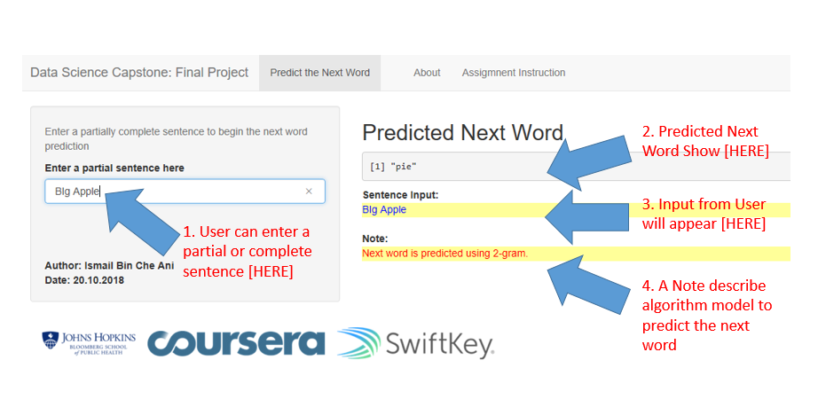

Coursera Data Science Capstone: Final Project Submission
========================================================
author: ISMAIL CHE ANI
date: Sat Oct 20 10:49:45 2018

Predict the Next Word

Introduction
========================================================
type: sub-section
This presentation is created as Final Project Submission for the Coursera Data Science Capstone Course. 

To try the apps, you can go to [HERE]- [https://jackjill.shinyapps.io/coursera-final-submission/]. The app is build as a predictive text model combined with a shiny app UI. It can predict the next word as user types a sentence similar to the way most smart phone keyboards that we have today. *It using technology from Swiftkey*. You also can have alook at our *[Github Repo]* at [https://github.com/jamalparit/coursera-final-submission]

Getting & Cleaning the Data
========================================================
type: sub-section

Before building the word prediction algorithm, data are first processed and cleaned as steps below:

- A subset of the original data was sampled from the three sources (blogs,twitter and news) which is then merged into one.
- Next, data cleaning is done by conversion to lowercase, strip white space, and removing punctuation and numbers.
- The corresponding n-grams are then created (Quadgram,Trigram and Bigram).
- Next, the term-count tables are extracted from the N-Grams and sorted according to the frequency in descending order.
- Lastly, the n-gram objects are saved as R-Compressed files (.RData files).

Description of the algorithm to make the prediction
========================================================
type: sub-section

The prediction model for next word is using n-gram and backoff models. Explanation how it work is as below:

1. It loaded a compressed data sets containing descending frequency sorted n-grams.
2. Before the prediction of the next word it will clean the user input words.
3. Algorithma that this app use is first it used Quadgram and if no Quadgram is found, back off to Trigram and If no Trigram is found, back off to Bigram and If no Bigram is found, back off to the most common word with highest frequency 'the' is returned.

Shiny Application
========================================================
type: sub-section

A Shiny application was developed based on the next word prediction model described previously as shown below. </img>

